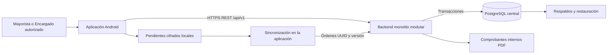

# Arquitectura inicial consolidada

> **Proyecto:** Gestión comercial mayorista de papa · **Entregable:** 1 · **Versión:** 1.1

La tablet ejecuta presentación, validación de captura y persistencia temporal. El backend aplica autorización y reglas comerciales; PostgreSQL conserva los hechos confirmados. La tablet nunca accede directamente a la base central.

Una orden pendiente no equivale a una operación central confirmada. El servidor valida sesión, negocio, reemplazo y versión antes de aplicar inventario y dinero. El cierre de pesaje crea lotes pendientes; la liquidación habilita disponibilidad. Un conflicto exige revisión y no sobrescribe hechos.

La analítica predictiva permanece como evolución condicionada por CL-08. El despliegue en contenedores está preparado, pero su ejecución y la prueba de carga permanecen pendientes según la evidencia disponible.

Vistas relacionadas: [contenedores](../04-modelo-c4/Nivel2-DiagramadeContenedores.md) y línea base (documentación compartida del proyecto).

## Capas y responsabilidades

| Capa | Elementos del proyecto | Responsabilidad |
| --- | --- | --- |
| Presentación | Aplicación Android, pantallas y controles | Capturar datos y mostrar el estado real de la operación |
| Entrada del backend | REST, identidad, DTO y manejo de errores | Validar identidad, permisos y estructura de solicitudes |
| Aplicación y negocio | Recepción, compra, venta, inventario, cuentas y costos | Aplicar reglas y coordinar efectos transaccionales |
| Persistencia e integración | ORM, PostgreSQL, cola local y PDF | Conservar hechos centrales, pendientes y comprobantes |

## Recorrido principal de compra

1. Registrar proveedor, fecha, vehículo, conductor y variedades.
2. Capturar cada saco con peso, tara cuando corresponda y variedad; revisar totales.
3. Cerrar pesaje y conservar detalle individual; los lotes permanecen pendientes.
4. Registrar precio, modalidad de flete, adelantos, descuentos y pago al contado o cuotas.
5. Confirmar liquidación central: hacer disponibles los lotes y crear los efectos financieros y de auditoría en una transacción.
6. Consultar el resultado confirmado y generar el comprobante interno según permisos.

Si la conexión falla, la captura autorizada se conserva pendiente. El mismo UUID debe reutilizarse al recuperar respuesta; nunca se presenta un borrador como confirmación central.
