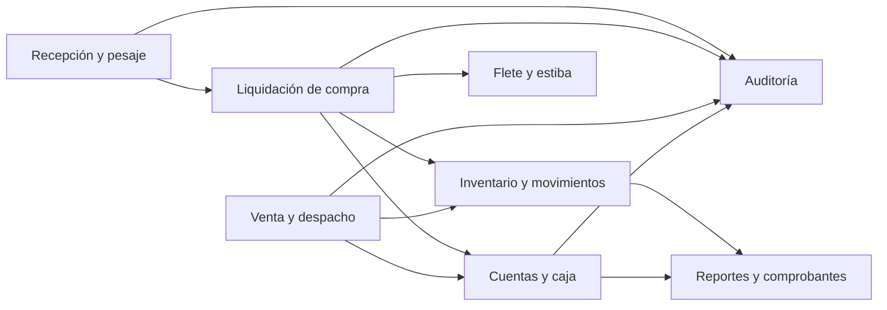

# Componentes arquitectónicos

> **Proyecto:** Gestión comercial mayorista de papa · **Entregable:** 1 · **Versión:** 1.1

| Componente | Responsabilidad | Corte / requisitos |
| --- | --- | --- |
| Identidad | Sesiones, roles, negocio y reemplazos | 001; RF01–02 |
| Catálogos y logística | Relaciones comerciales, variedades, vehículos y transportistas | 002/004; RF03–05 |
| Recepción y pesaje | Sacos, bruto/tara/neto, corrección y cierre | 002; RF05–06B |
| Compras | Precio, flete, descuentos y liquidación | 002; RF07, RF14 |
| Ventas y devoluciones | Despacho y compensación comercial | 003; RF10–12 |
| Inventario | Lotes, disponibilidad y movimientos | 003; RF08–09 |
| Cuentas y caja | Cuotas, pagos, cobros y reversos | 004; RF13–15 |
| Flete y estiba | Costos y liquidación de grupos | 004; RF15 |
| Cola y sincronización | Órdenes locales, dependencias y conflictos | 005; RF21 |
| Auditoría | Hechos anexables y consulta protegida | 005; RF22 |
| Reportes y comprobantes | Resumen, margen, precios y PDF interno | 006; RF12, RF16–18 |
| Analítica predictiva | Estimaciones condicionadas a CL-08 | 007; RF19–20 |

Los nombres representan responsabilidades; la cola pertenece al cliente y la predicción aún no es un contenedor desplegado. RF23 permanece requisito documental: no se acredita aquí un canal de notificaciones configurables implementado.

## Relaciones y propiedad de responsabilidades

| Origen | Destino | Propósito | Comunicación |
| --- | --- | --- | --- |
| Pantalla | Servicio API/cola | Enviar o conservar la orden del usuario | Llamada local |
| Cliente | REST/identidad | Autenticar y ejecutar contratos protegidos | HTTPS/JSON en despliegue |
| Recepción | Inventario | Crear lotes pendientes al cerrar pesaje | Coordinación central |
| Compra | Inventario/cuentas/caja/flete | Liquidar, habilitar stock y registrar obligaciones/costos | Transacción PostgreSQL |
| Venta | Inventario/cuentas/caja | Validar disponibilidad y confirmar despacho | Transacción PostgreSQL |
| Módulos operativos | Auditoría | Registrar hechos y compensaciones | Persistencia central |
| Reportes | Datos confirmados | Consultar margen, precios y cuentas | Lectura por negocio |

La partición expresa responsabilidades. El código actual utiliza entidades compartidas para transacciones entre dominios; no se promete propiedad exclusiva de tablas ni eventos internos independientes que aún no existen.

## Diagrama de colaboración

