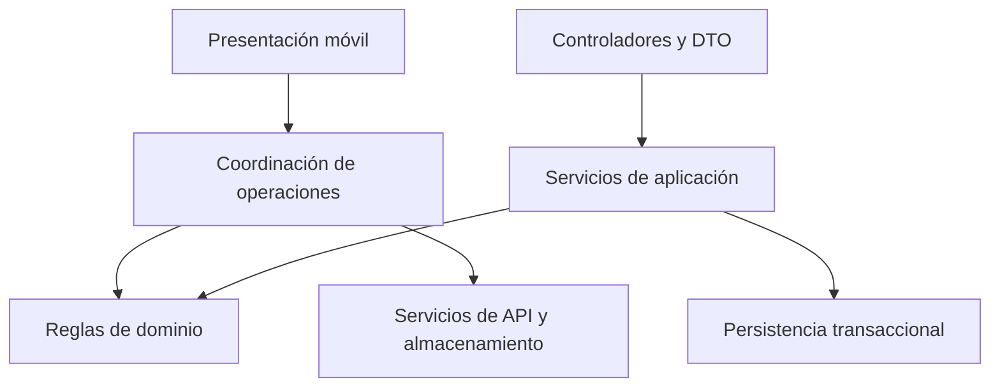

# Enfoque arquitectónico

> **Proyecto:** Gestión comercial mayorista de papa · **Entregable:** 1 · **Versión:** 1.1

SDD dirige las decisiones: constitution → specify → clarify → plan → tasks → implement → converge. Los cortes verticales 001–006 cubren acceso, compra, venta/inventario, cuentas/costos, sincronización/auditoría y reportes/comprobantes. El corte 007 requiere resolver CL-08 antes de implementar predicción.

Prioridades: continuidad local (DA01), transacciones e idempotencia (DA02), aislamiento (DA03), crecimiento medido (DA04), analítica progresiva (DA05), evolución modular (DA06) y recuperación (DA07).

Cada cierre exige requisito, marco Figma, código y evidencia de pruebas. MERCADO determina la referencia visual; no modifica permisos ni fórmulas. Los cambios funcionales se registran primero en especificación y decisiones. La alta fidelidad visual sigue pendiente de convergencia según la auditoría del frontend.

Referencias de método consideradas: GitHub Spec Kit; UI UX Pro Max para sistema visual; Expo y Callstack para móvil; Vercel para React/web cuando corresponda; Wshobson solo para necesidades específicas. Esta consolidación no instala ni ejecuta contenido externo.

## Enfoque de separación interna

| Elemento | Aplicación al negocio mayorista |
| --- | --- |
| Objetivo | Aislar reglas de peso, precio, stock y saldos de la interacción táctil |
| Problema que resuelve | Evitar que cambiar un formulario altere cálculos o autorización |
| Dominio | Funciones deterministas de dinero, peso, reparto y disponibilidad |
| Aplicación | Coordinación de recepción, liquidación, venta y compensación |
| Infraestructura | ORM, migraciones, almacenamiento seguro, transporte HTTP y PDF |
| Presentación | Rutas móviles, pantallas, controladores y mensajes |
| Composición | Conectar dependencias de módulos y servicios |

La orientación a dominio guía el diseño. La dependencia directa de algunos servicios al ORM es una limitación actual documentada, no evidencia de cumplimiento completo de inversión de dependencias.
