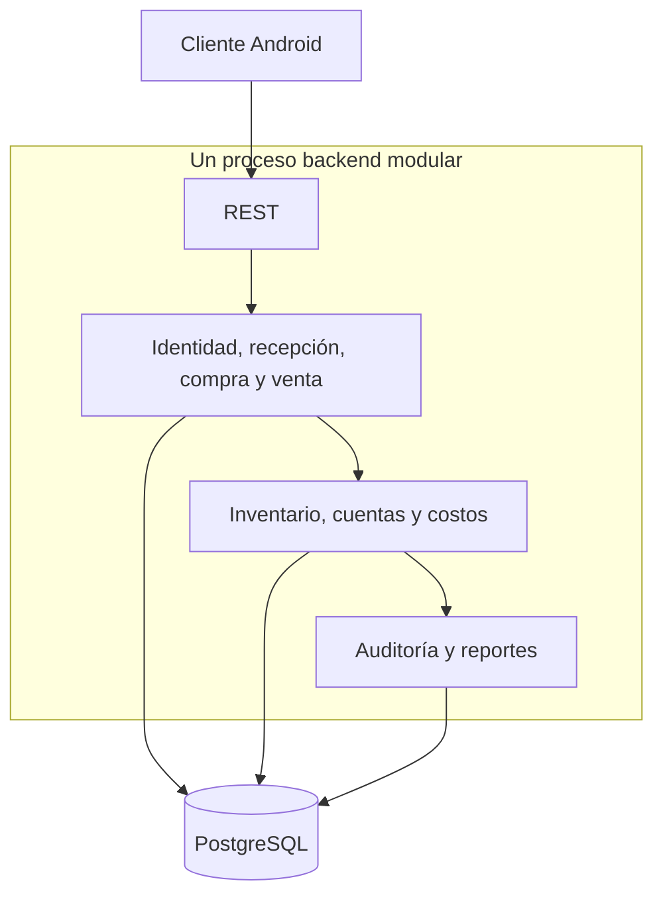

# Estilo arquitectónico

> **Proyecto:** Gestión comercial mayorista de papa · **Entregable:** 1 · **Versión:** 1.1

Monolito modular organizado en capas. Los módulos comerciales comparten un proceso y una base transaccional, conservando responsabilidades explícitas. No hay evidencia de microservicios desplegados.

Presentación → aplicación → dominio → infraestructura. En el cliente, rutas y pantallas delegan captura y operaciones a dominio, datos y servicios. En el backend, controladores y DTO validan límites; servicios coordinan transacciones y cálculos de dominio; entidades y migraciones representan persistencia.

La separación es un objetivo arquitectónico con implementación parcial: `PurchaseService` accede a entidades de cuentas, inventario y flete dentro de una transacción. Evitar describirlo como arquitectura hexagonal completa. Una extracción futura debe conservar atomicidad y estar justificada por una necesidad verificable.

Tradeoff: menor complejidad de despliegue y consistencia fuerte a cambio de despliegue conjunto y riesgo de acoplamiento entre módulos. DA02, DA06, AC03 y AC07 orientan sus límites.

## Organización y despliegue

| Aspecto | Regla |
| --- | --- |
| Unidad de despliegue | API y módulos comerciales se despliegan juntos |
| Separación cliente/servidor | Cliente y API evolucionan mediante contratos REST |
| Consistencia | Una operación comercial coordina stock y dinero atómicamente |
| Crecimiento | Medir carga y añadir capacidad antes de fragmentar el sistema |
| Costo operativo | Mantener infraestructura ajustada a R07 |

Microservicios solo se evaluarían con una necesidad acreditada de escala, aislamiento o despliegue independiente y una decisión SDD; no forman parte de la arquitectura inicial.
