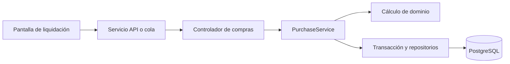

# Patrones de diseño aplicados

> **Proyecto:** Gestión comercial mayorista de papa · **Entregable:** 1 · **Versión:** 1.1

| Patrón o mecanismo | Aplicación y evidencia | Límite |
| --- | --- | --- |
| Inyección de dependencias | Servicios NestJS reciben DataSource y AuditService | No implica separación hexagonal completa |
| DTO y validación en frontera | `purchase/http/settle-purchase.dto.ts` y controladores | Dominio y base deben revalidar invariantes |
| Repositorio | Acceso mediante repositorios de entidades | Algunos servicios acceden a varios módulos |
| Transacción / unidad de trabajo | `PurchaseService.settle` usa `DataSource.transaction` | Mantener efectos comerciales atómicos |
| Orden idempotente | `clientOperationId`, bloqueo y recuperación de resultado | UUID no reemplaza autorización ni versión |
| Concurrencia optimista y bloqueo | Versión de agregado y bloqueo de lotes | Conflictos no se resuelven sobrescribiendo |
| Cola persistente en cliente | Pendientes cifrados y reintento dependiente | No se afirma un broker ni outbox de servidor |
| Adaptadores de integración | Servicios de API, sesión y compartición del cliente | Revisar límites al cambiar integración |
| Compensación | Reversos y devoluciones referencian hechos | No se afirma Event Sourcing ni saga distribuida |

La selección responde a AC03, AC04 y AC07. Son mecanismos constatados o políticas aprobadas; no se introduce un catálogo de patrones sin necesidad.

## Funcionamiento aplicado a la compra de papa

| Patrón | Operación concreta | Beneficio | Condición de uso |
| --- | --- | --- | --- |
| Adapter | Servicio móvil traduce una orden y la respuesta REST | La pantalla no procesa detalles del transporte | Mantener modelos y errores explícitos |
| Repository | Servicio central busca liquidación y persiste entidades | Agrupar el acceso a datos | El ORM actual no garantiza independencia tecnológica completa |
| Unidad de trabajo | Liquidación confirma stock y cuenta/caja | Evita operaciones parcialmente aplicadas | Todas las escrituras críticas comparten transacción |
| Idempotencia | Reenvío tras respuesta perdida devuelve la compra existente | Evita duplicar lotes y deudas | Misma clave por orden y negocio |
| Compensación | Anulación registra reverso vinculado | Conserva trazabilidad histórica | Motivo y permiso aprobados |

## Patrones de evolución

Observer podría evaluarse para recordatorios cuando RF23 tenga canal y política definidos. Factory se justifica solo si la construcción de operaciones adquiere variaciones complejas. Facade podría reducir el acoplamiento entre compra y entidades de otros módulos. Son alternativas futuras sujetas a plan; no se afirma que estén implementadas.

No se añade Decorator/Redis por analogía con el ejemplo: no existe una decisión vigente de caché central y los saldos oficiales no deben depender de ella.
