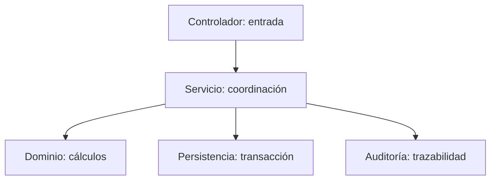

# Principios de diseño

> **Proyecto:** Gestión comercial mayorista de papa · **Entregable:** 1 · **Versión:** 1.1

1. Separar captura, reglas comerciales y persistencia; pantallas no determinan saldos oficiales.
2. Mantener responsabilidad explícita por módulo; reconocer acoplamientos existentes antes de extraer servicios.
3. Validar entradas, permisos, negocio y versión en servidor; la navegación es solo una ayuda de interfaz.
4. Mantener cálculos deterministas y pruebas de redondeo, tara, saldos y disponibilidad.
5. Conservar trazabilidad de origen, usuario, tiempo, motivo y compensación; no borrar historia confirmada.
6. Proteger secretos y pendientes; sesión segura y separación por usuario/negocio.
7. Reutilizar tokens y componentes visuales; objetivos táctiles accesibles, estados claros y adaptación a tamaños aprobados.
8. Introducir complejidad cuando exista driver y evidencia; no añadir microservicios, IA o integraciones fuera del alcance aprobado.

Verificar estos principios mediante revisión de dependencias, pruebas de dominio/integración, recorridos nativos y convergencia con Figma. La auditoría actual no acredita cierre visual total.

## SOLID aplicado al módulo de referencia

| Principio | Aplicación al proyecto | Evidencia o límite |
| --- | --- | --- |
| S · Responsabilidad única | Controller traduce entrada; funciones calculan; servicio coordina | PurchaseService concentra varias responsabilidades transaccionales; revisar su crecimiento |
| O · Abierto/cerrado | Variaciones de infraestructura se aíslan en servicios/adaptadores | Es un criterio de evolución, no prueba de puertos para toda integración |
| L · Sustitución | Una implementación alternativa debe preservar resultados y errores del contrato | Verificar precisión, autorización e idempotencia; una memoria simple no reproduce concurrencia PostgreSQL |
| I · Segregación | Consumidores usan contratos de la operación necesaria | Evitar interfaces que obliguen a la pantalla de pesaje a conocer caja o reportes |
| D · Inversión de dependencias | Mantener cálculo independiente de UI/transporte | Hay inyección de dependencias, pero PurchaseService depende de DataSource; DIP completo no acreditado |

## Efecto de los principios en cambios concretos

| Cambio | Diseño esperado | Verificación |
| --- | --- | --- |
| Ajustar regla de estiba | Cambiar costos sin alterar captura de pesaje | Regresión de costos y cuentas |
| Cambiar presentación de formulario | Reutilizar contrato y cálculo de dominio | Mismos totales y permisos |
| Sustituir transporte o almacenamiento local | Adaptar el servicio y conservar semántica de pendientes | Recuperación, cifrado y no duplicación |
| Extraer una fachada de inventario | Mantener confirmación atómica con compra/venta | Rollback y pruebas concurrentes |

La relación entre SOLID y patrones se verifica en dependencias y comportamiento: usar inyección o repositorios no acredita automáticamente todos los principios.
