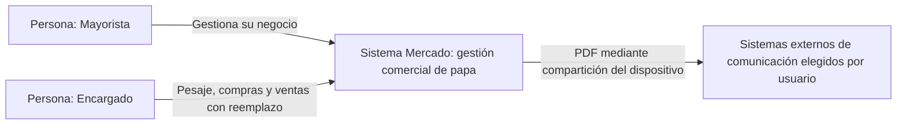

# C4 nivel 1: contexto

> **Proyecto:** Gestión comercial mayorista de papa · **Entregable:** 1 · **Versión:** 1.1

Proveedor, comprador, conductor y estibadores son participantes comerciales registrados; no se les atribuye cuenta de acceso. Figma y GitHub apoyan desarrollo y no son dependencias operativas del sistema. El comprobante es interno; no hay integración SUNAT ni pasarela de pagos en el MVP. Trazabilidad: RF01–02, RF12, R06.

## Objetivo y audiencia

Mostrar el sistema como una unidad y explicar quién opera el negocio y dónde termina su responsabilidad. Audiencia: mayoristas, docente, diseño y equipo técnico. La tecnología y las bases de datos se detallan en el siguiente nivel.

## Personas y sistemas

| Elemento | Tipo | Responsabilidad |
| --- | --- | --- |
| Mayorista | Persona usuaria | Control integral del negocio y sus usuarios |
| Encargado | Persona usuaria | Sustitución operativa limitada y temporal |
| Mercado | Sistema en alcance | Registro comercial, inventario, saldos y comprobantes |
| Aplicación de comunicación elegida | Sistema externo opcional | Recibir el PDF por compartición del dispositivo |

## Relaciones y decisiones

| Origen | Destino | Relación |
| --- | --- | --- |
| Mayorista | Mercado | Registra y supervisa operaciones de su negocio |
| Encargado | Mercado | Registra pesajes/compras/ventas durante reemplazo |
| Mercado | Aplicación externa | Entrega archivo cuando el usuario decide compartir |

No se presupone contrato con un proveedor de mensajería. Los participantes comerciales se registran sin convertirlos en actores de autenticación. Canal de recordatorios RF23 y analítica CL-08 conservan sus pendientes.

Siguiente vista: [contenedores](Nivel2-DiagramadeContenedores.md).
