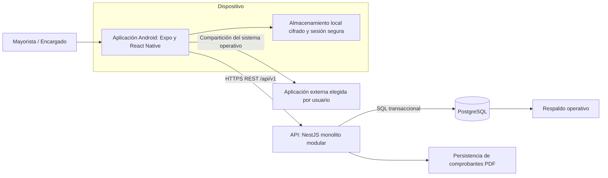

# C4 nivel 2: contenedores

> **Proyecto:** Gestión comercial mayorista de papa · **Entregable:** 1 · **Versión:** 1.1

El almacenamiento local es parte del dispositivo, sin servidor independiente. La persistencia de PDF es responsabilidad del backend; no se presupone un proveedor de objetos contratado. HTTPS es requisito de despliegue; entornos locales de verificación usan HTTP. Predicción, broker y caché central no se muestran como servicios desplegados. DA01–03 y DA07 explican los límites.

## Objetivo

Mostrar aplicaciones y almacenes de datos, responsabilidades y comunicación. Un contenedor C4 es una unidad de ejecución o almacenamiento; no equivale necesariamente a un contenedor Docker.

## Contenedores y datos

| Elemento | Tecnología registrada | Responsabilidad | Datos |
| --- | --- | --- | --- |
| Aplicación Android | Expo/React Native y TypeScript | Interacción táctil, sesión y captura | Estado visual, catálogos y órdenes pendientes |
| API Mercado | NestJS y TypeScript | Autoridad comercial y de autorización | Coordina información central |
| Base central | PostgreSQL | Persistencia transaccional | Operaciones, lotes, saldos y auditoría |
| Almacén local asociado al cliente | Cola cifrada y SecureStore | Continuidad temporal | Claves/sesión y pendientes por usuario/negocio |
| Persistencia de PDF asociada al backend | Archivos de comprobantes internos | Conservación e integridad del documento | PDF, hash, versión y estado |

Almacén local y PDF describen responsabilidades de almacenamiento; no se afirma que existan dos servicios independientes desplegados.

## Relaciones y seguridad

| Comunicación | Mecanismo | Control |
| --- | --- | --- |
| Usuario → cliente | Interacción táctil | Navegación y acciones visibles por rol |
| Cliente → API | HTTPS/JSON REST en despliegue | Token opaco Bearer; autorización por operación |
| API → PostgreSQL | SQL transaccional | Credenciales de servidor y negocio en consultas |
| Cliente → almacén local | Acceso en dispositivo | Cifrado y separación por usuario/negocio |
| API → PDF | Generación/consulta protegida | Permiso, hash e invalidación |
| Cliente → aplicación externa | Panel de compartición del dispositivo | Acción explícita del usuario |

El servidor es el único que determina resultados comerciales confirmados. La operación offline queda pendiente hasta revalidación central. No se incorpora JWT, Redis ni conexiones desde la tablet a PostgreSQL por copiarlos del ejemplo.

Anterior: [contexto](Nivel1-DiagramadeContextodelSistema.md). Siguiente: [componentes](Nivel3-Diagrama-de-Componentes.md).
