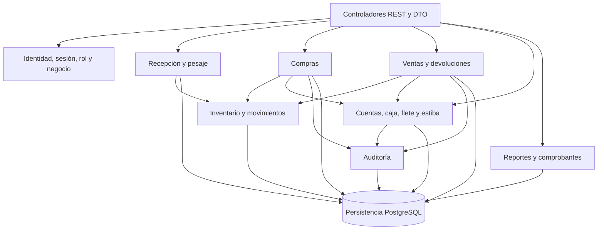

# C4 nivel 3: componentes de la API

> **Proyecto:** Gestión comercial mayorista de papa · **Entregable:** 1 · **Versión:** 1.1

Vista lógica de responsabilidades dentro de un mismo backend. Las flechas comerciales pueden representar acceso a entidades compartidas dentro de una transacción, no necesariamente llamadas entre servicios. Identidad protege las rutas y auditoría cubre los módulos operativos. La sincronización del cliente reenvía órdenes a los mismos contratos idempotentes; no introduce una segunda autoridad financiera.

## Objetivo y contenedor detallado

Abrir la API Mercado y explicar sus responsabilidades internas. Audiencia: arquitectura y desarrollo. Los componentes son grupos lógicos dentro del mismo despliegue.

## Correspondencia con el código

| Responsabilidad | Carpeta en `mercado-api/src` | Resultado |
| --- | --- | --- |
| Identidad | `identity` | Sesión, rol, negocio y reemplazo |
| Recepción/pesaje | `reception` | Cargamento y sacos conservados |
| Compra | `purchase` | Liquidación central |
| Inventario | `inventory` | Lotes y movimientos |
| Venta/devolución | `sales` | Despacho y compensación |
| Cuentas/caja | `accounts` | Saldo, pagos y asientos |
| Flete | `freight` | Costo y liquidación de transporte |
| Estiba | `stowage` | Participación y liquidación por grupo |
| Logística | `logistics` | Vehículos y transportistas |
| Auditoría | `audit` | Historial protegido |
| Reportes | `reports` | Consultas de información confirmada |
| Cálculos compartidos | `common/domain` | Precisión y reparto determinista |

## Reglas del monolito

1. Componentes backend se despliegan juntos; no hay comunicación de red entre cada módulo comercial.
2. Permisos y aislamiento se aplican antes de modificar recursos y también al leer archivos.
3. Compra y venta conservan la transacción coordinada de inventario y dinero.
4. El acceso directo entre entidades de varios dominios está documentado; reducirlo es evolución técnica, no una propiedad ya conseguida.
5. Auditoría y compensaciones conservan origen y motivo; reportes no alteran hechos.
6. Analítica predictiva requiere especificación y decisiones aprobadas antes de convertirse en componente operativo.

Anterior: [contenedores](Nivel2-DiagramadeContenedores.md). Siguiente: [código](Nivel4-DiagramadeCodigo.md).
