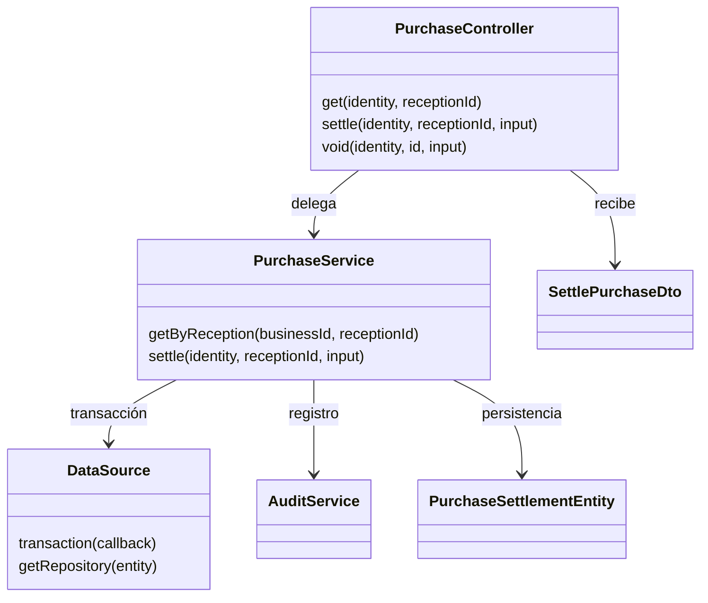
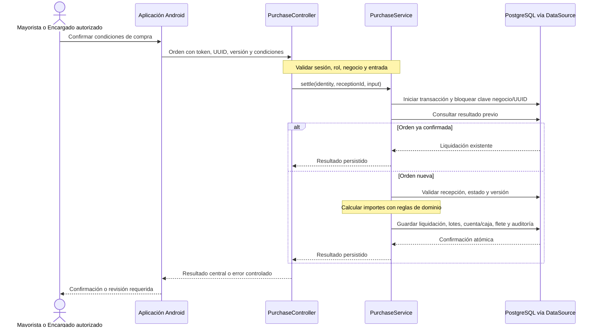

# C4 nivel 4: código de liquidación de compra

> **Proyecto:** Gestión comercial mayorista de papa · **Entregable:** 1 · **Versión:** 1.1

Vista acotada basada en `mercado-api/src/purchase/purchase.controller.ts` y `purchase.service.ts` inspeccionados el 6 de octubre. Muestra dependencias y funciones concretas, no clases futuras.

El controlador aplica guardas de sesión/rol y valida identificadores. `settle` abre una transacción, toma bloqueo por negocio y UUID y consulta si existe resultado previo. Usa entidades de recepción, inventario, cuentas y flete, además de funciones `calculateAmountByBasis`, `allocateProportionally`, `parseFixedDecimal` y `formatFixedDecimal`. Estos acoplamientos son explícitos en la vista de diseño; no se inventa una interfaz de repositorio inexistente.

Verificación pertinente: idempotencia, conflictos, cálculo monetario y efectos atómicos de los cortes 002/004/005. La documentación no ejecutó nuevamente las suites funcionales.

## Objetivo y alcance

Detallar la colaboración de la liquidación de compra. Audiencia: desarrollo. Se utiliza un diagrama de clases y una secuencia porque la operación combina autorización, cálculo y persistencia atómica.

## Clases y funciones

| Elemento | Tipo | Responsabilidad |
| --- | --- | --- |
| PurchaseController | Controlador | Traducir entrada HTTP y delegar |
| SettlePurchaseDto | Contrato de entrada | Estructura y validación |
| PurchaseService | Servicio | Coordinar liquidación idempotente |
| DataSource | Infraestructura | Gestionar transacción y repositorios |
| PurchaseSettlementEntity | Entidad persistente | Conservar liquidación y origen |
| AuditService | Servicio transversal | Registrar hechos asociados a identidad |
| calculateAmountByBasis | Función de dominio | Importe por kg o saco |
| parseFixedDecimal / formatFixedDecimal | Funciones de dominio | Conversión decimal exacta |
| allocateProportionally | Función de dominio | Reparto de importes preservando total |

## Secuencia: liquidar una compra

## Alternativas del recorrido

| Situación | Resultado esperado |
| --- | --- |
| Sin red antes del envío | Cliente conserva la orden autorizada como pendiente |
| Respuesta perdida tras confirmación | Reenviar UUID y recuperar resultado sin duplicación |
| Versión anterior | Conflicto 409 y revisión; no sobrescribir |
| Permiso/reemplazo inválido | Rechazo central sin aplicar efectos |
| Error durante escrituras | Rollback; sin liquidación parcial |
| Anulación posterior | Compensación autorizada con motivo y auditoría |

## Notación y principios

La flecha del diagrama de clases indica dependencia/uso; no representa un puerto de dominio inexistente. La secuencia muestra mensajes ordenados y una alternativa idempotente. No dibuja cada consulta SQL ni sustituye los contratos.

Repository, unidad de trabajo, idempotencia y compensación explican la operación. Responsabilidad única e inversión de dependencias orientan su evolución, pero la dependencia actual a DataSource se conserva explícita.

Anterior: [componentes](Nivel3-Diagrama-de-Componentes.md). Detalle: [diseño interno](../03-diseño-de-software/diseño-interno/diseño-interno-de-modulos.md).
